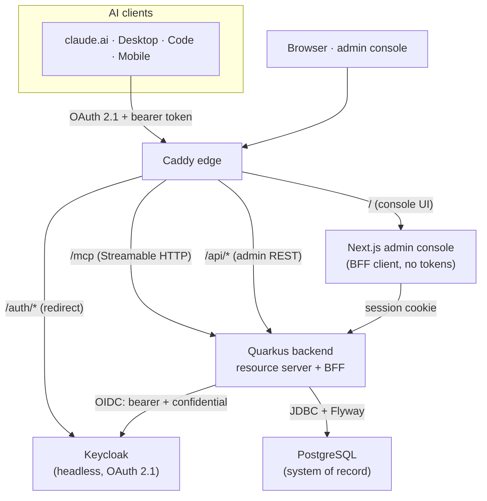

<div align="center">


# kumbuka

**Shared, persistent memory for AI assistants working with a team —
served over MCP, curated through an admin console, with a private space that stays private.**

[](https://github.com/kumbuka-ai/kumbuka/actions/workflows/ci.yml)


</div>

> **Status: pre-beta.** kumbuka is in active development. The architecture and
> data model are settled and the private-memory guarantee is a hard design
> constraint, but the project is not yet a hardened, shipped product. Expect
> rough edges and breaking changes.

*kumbuka* is Swahili — the imperative **"remember!"**. The project lives at
[kumbuka.ai](https://kumbuka.ai).

---

## The problem: the context tax

AI assistants are stateless between sessions. A team using them pays the same
toll over and over — re-explaining the things that should simply be known:

- *"We use Postgres as the system of record."*
- *"Money is integer minor units, never floats."*
- *"Service names are kebab-case."*

That steering knowledge — the decisions, conventions, and constraints that
shape how an assistant should work — is exactly what an assistant ought to
*remember* and apply without being told again. Today it lives in people's heads
and in scattered chat history, so every new session starts from zero.

## What kumbuka is

kumbuka makes that knowledge a first-class, team-owned asset. It gives a team a
durable, shared place for the rules an assistant should carry across
conversations, and serves them to any MCP-capable assistant (Claude and others)
over a remote **MCP server**. A web **admin console** lets the team curate the
shared memory.

It is deliberately **not** a document store or a RAG index. kumbuka holds
*work-steering knowledge* — a small, typed set of decisions, conventions,
constraints, definitions, open questions, and status — not a copy of your docs
or source, which stay in their own systems.

- **Shared and curatable** — the team sees and edits what the assistant relies
  on, instead of each person accumulating an opaque, divergent context.
- **Portable** — any MCP-capable assistant reads and writes it through one
  endpoint.
- **Bounded** — a fixed taxonomy and explicit scopes keep the memory legible
  rather than letting it sprawl.

## The private-memory guarantee

> **A member's private memory is theirs alone.** It is reachable only by them,
> only over their own authenticated MCP session. **No admin, no console screen,
> and no team-facing API can read it.**

This is the backbone of the product, not a feature flag. It is enforced at the
**data-access layer** — the privileged (admin/console) code paths have no route
that can return private rows — **not** by a configuration toggle that could be
flipped. Disabling a member suspends their account but leaves their private
memory untouched and theirs.

See [the Security & privacy guide](https://docs.kumbuka.ai/operations/security/) for how this is structurally enforced.

## Quickstart (self-host the Community Edition)

The Community Edition is the free, self-hosted, single-tenant memory core. It
runs as a single Docker Compose stack (backend · PostgreSQL · Keycloak · Caddy).
The deployable stack lives in the
[`kumbuka-server`](https://github.com/kumbuka-ai/kumbuka-server) repository:

```bash
git clone https://github.com/kumbuka-ai/kumbuka-server
cd kumbuka-server
cp .env.example .env                  # set your domain + secrets
docker compose --profile app up -d    # backend + postgres + keycloak + caddy
```

The admin console is a separate service, added to the same stack via a small
`compose.override.yml` — see the step-by-step
**[Quickstart guide](https://docs.kumbuka.ai/get-started/quickstart/)**, which also covers prerequisites,
first run, and the [`kumbuka-server` runbook](https://github.com/kumbuka-ai/kumbuka-server#quick-start-dev)
for production deployment.

## Connect your assistant

kumbuka is reached by AI clients as a **custom MCP connector** — an endpoint
URL, a client id, and a client secret. In claude.ai you add it under
**Settings → Connectors**, sign in once through the OAuth flow, and your
assistant can then call the memory tools on your behalf, including your own
private scope.

See **[Connecting an assistant guide](https://docs.kumbuka.ai/get-started/connecting-an-assistant/)** for
the walkthrough, and the
[`kumbuka-server` guide](https://github.com/kumbuka-ai/kumbuka-server#connecting-claude-clients)
for Claude Desktop, Claude Code, and Claude Mobile.

## MCP tools at a glance

Served over **Streamable HTTP** at `/mcp`, scoped to the authenticated user. The
tool names are kept functional on purpose — the model reads them, and clarity
beats brand noise.

| Tool | What it does |
|---|---|
| `memory_remember` | Write or append an entry (upsert on `key`). Caller picks `scope`, `type`, optional `key`. |
| `memory_recall` | Read entries with filters: `scope`, `type`, substring `query`, optional `include_global`. |
| `memory_forget` | Remove an entry by `id` or by `(scope, key)`. |
| `memory_scopes` | List the scopes the caller may see (their private scope plus shared ones). |
| `memory_load_context` | A typed, ready-to-inject digest of the relevant rules, grouped by type. |

Full reference: **[MCP tools reference](https://docs.kumbuka.ai/reference/mcp-tools/)**.

## Architecture

A single Docker Compose stack. The **Quarkus / Java 21 backend** is the only
component that talks to the identity provider; it serves both the `/mcp` surface
and the admin REST API. **Keycloak** (headless, OAuth 2.1) is the IdP; the
console is a **BFF** client and never holds tokens. **PostgreSQL** is the system
of record (Flyway migrations). **Caddy** is the edge.



The backend plays **two OIDC roles**: a bearer **resource server** for `/mcp`,
and a confidential **web-app client** (BFF) for the console. Details and the
data flow are in **[Architecture guide](https://docs.kumbuka.ai/operations/architecture/)**.

## Repo map

| Repo | What it is |
|---|---|
| [`kumbuka`](https://github.com/kumbuka-ai/kumbuka) | This repo — the project front door and public documentation. |
| [`kumbuka-server`](https://github.com/kumbuka-ai/kumbuka-server) | The Quarkus backend, the MCP surface, Keycloak realm/theme, and the Docker Compose stack you deploy. |
| [`kumbuka-console`](https://github.com/kumbuka-ai/kumbuka-console) | The Next.js admin console (the team-facing UI). |

## Documentation

The full documentation site lives at **[docs.kumbuka.ai](https://docs.kumbuka.ai)** (English and German).

| Guide | For |
|---|---|
| [Overview](https://docs.kumbuka.ai/get-started/overview/) | What kumbuka is and the personal/shared boundary. |
| [Concepts](https://docs.kumbuka.ai/concepts/data-model/) | The domain model: scopes, the entry taxonomy, authorship, keys. |
| [Quickstart](https://docs.kumbuka.ai/get-started/quickstart/) | Self-hosting the Community Edition, step by step. |
| [Connecting an assistant](https://docs.kumbuka.ai/get-started/connecting-an-assistant/) | Adding the connector in claude.ai. |
| [MCP tools](https://docs.kumbuka.ai/reference/mcp-tools/) | Reference for the five `memory_*` tools. |
| [Architecture](https://docs.kumbuka.ai/operations/architecture/) | Topology, the two OIDC roles, components, data flow. |
| [Security & privacy](https://docs.kumbuka.ai/operations/security/) | The private guarantee, structurally enforced; disable vs. erasure. |
| [Configuration](https://docs.kumbuka.ai/reference/configuration/) | Env/config knobs and policies. |
| [Editions](https://docs.kumbuka.ai/concepts/editions/) | Community Edition vs. the commercial path. |

## License

kumbuka is licensed under the **GNU Affero General Public License v3.0**
([AGPL-3.0](LICENSE)). Because kumbuka is typically deployed as a
network-accessible service, AGPL **§13** applies: if you run a modified version
and let users interact with it over a network, you must offer those users the
corresponding source of your modified version.

A commercial **dual-license** path is planned for organizations that cannot
operate under the AGPL or that want the commercial-edition features (see
[Editions](https://docs.kumbuka.ai/concepts/editions/)). It is not yet generally available — no
prices or dates yet.

## Contributing

Contributions are welcome. Start with **[CONTRIBUTING.md](CONTRIBUTING.md)** for
how to contribute and where the per-repo dev setup lives. To report a security
issue, see **[SECURITY.md](SECURITY.md)** — please do not open a public issue for
vulnerabilities.
