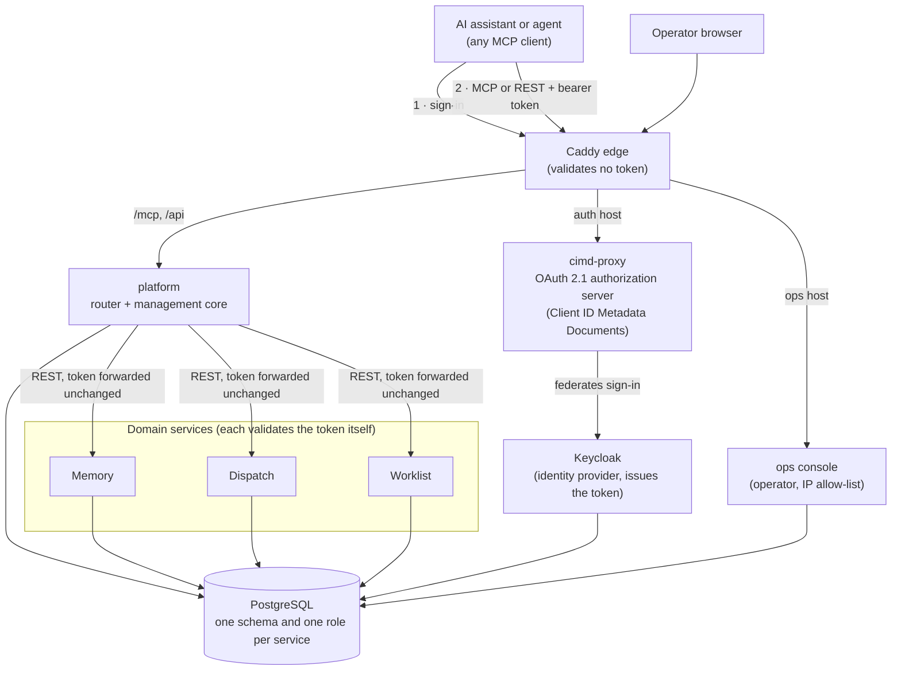

# kumbuka

**Services for teams that work with AI assistants and agents — curated rules,
commissioned work, and the inventory of what is to be done, each held as
individually addressable objects, each in a service of its own.**

> **Status: pre-beta.** kumbuka is in active development. The architecture and
> data model are settled and the private-memory guarantee is a hard design
> constraint, but the project is not yet a hardened, shipped product. Expect
> rough edges and breaking changes.

*kumbuka* is Swahili — the imperative **"remember!"**. The project lives at
[kumbuka.ai](https://kumbuka.ai).

---

## The problem: a result without a record

AI assistants are stateless between sessions, and the work they do leaves a
result but rarely a record. A team using them pays twice.

It pays the **context tax**: the same rules are explained again in every new
session — *"we use Postgres as the system of record"*, *"money is integer minor
units, never floats"* — because the decisions, conventions and constraints that
should shape the work live in people's heads and in scattered chat history.

And it loses the **trail of the work itself**. Once an assistant or an agent
has done something, the questions that matter later are hard to answer: who
asked for it, under which rule, what came back, and who accepted it. A session
transcript ends with the session; a finished file does not say which request
produced it.

## What kumbuka is

kumbuka is a set of services that hold exactly those things — what a team has
settled, the work it commissions and gets back, and what it still intends to
do — as objects that are addressed one by one, read by assistants over the
**Model Context Protocol (MCP)**, and curated by the team.

| Service | What it holds |
|---|---|
| **Memory** | The curated rules a team has settled — decisions, conventions, constraints, definitions, open questions and status — typed, scoped, and read by the assistant at the start of the work. |
| **Dispatch** | Work commissioned and returned: one party states a task, another takes it up and answers, and the acceptance of the answer is an act of its own; the commission freezes when it is sent, so it stays readable later who asked what, who answered, and what was accepted. |
| **Worklist** | The inventory of what is to be done and in what order: items that are created, characterised, planned, claimed, worked and terminated, and that stay editable for their whole life. |
| **Documents** | The documents that say what currently holds. `kumbuka-documents` is not yet publicly available. |

Each service is built as a **product of its own** and published in its own
repository. Every service has a complete REST interface. **Dispatch** and
**Worklist** each also carry their own MCP endpoint; **Memory** has no MCP adapter of its own and is reached by
assistants through the platform's MCP entry point (see
[Architecture](#architecture)).

kumbuka is deliberately **not** a document store or a RAG index, and it does
not watch what people do. It holds *curated* content that someone wrote down
and the team stands behind, not a copy of your docs or source, which stay in
their own systems.

## The private-memory guarantee

> **A member's private memory is theirs alone.** It is reachable only by them,
> only over their own authenticated MCP session. **No admin, no console screen,
> and no team-facing API can read it.**

This is the backbone of the product, not a feature flag. It is enforced at the
**data-access layer** — the privileged (admin/console) code paths have no route
that can return private rows — **not** by a configuration toggle that could be
flipped. Disabling a member suspends their account but leaves their private
memory untouched and theirs.

See [the Security & privacy guide](https://docs.kumbuka.ai/operations/security/) for how this is structurally enforced.

## Tenant separation

Each service keeps its own schema and its own database role in PostgreSQL.
Tenants are separated by **row-level security** on the tenant axis: the policy
fails closed, so a request that is not bound to a tenant sees no rows rather
than all of them. The runtime role of a service owns nothing and holds only the
privileges its migrations enumerate, so it cannot switch the policy off.

## One sign-in for every service

Sign-in runs through **[`cimd-proxy`](https://github.com/kumbuka-ai/cimd-proxy)**,
the OAuth 2.1 authorization server in front of the identity provider. Outward
it speaks **Client ID Metadata Documents**: an MCP client identifies itself by
a URL it controls, so the endpoint URL is all a client needs — no client id and
no client secret to copy around. Inward it federates the sign-in to
**Keycloak**, which issues the token.

From outside, the platform is **one resource with one audience**. One sign-in
yields one token, and that token is valid for every service behind the entry
point. Each service validates the unchanged token itself; none relies on a
predecessor having checked it.

## Connect your assistant

kumbuka is reached by AI clients as a **custom MCP connector**. In claude.ai you
add it under **Settings → Connectors**, sign in once through the OAuth flow, and
your assistant can then call the services' tools on your behalf, including your
own private memory scope.

Through the platform's entry point the tools are named `<service>_<verb>` —
`memory_query`, `dispatch_claim`, `worklist_create` and so on — so one
connector carries the tools of every service.

## Architecture

The diagram shows the hosted deployment as it runs today. **Caddy** is the
edge and validates no token. **cimd-proxy** is the authorization server, and
**Keycloak** is the identity provider behind it. The **platform** is the entry
point: a router that reads the service named in an address and forwards the
call over REST to the service that owns it, together with the management core
for scopes, teams and settings. **Memory**, **Dispatch** and **Worklist** each
validate the token themselves and keep their own schema in one **PostgreSQL**
instance. The **ops console** is the operator's own interface, reachable only
from an IP allow-list.

```mermaid
flowchart TD
    C["AI assistant or agent<br/>(any MCP client)"]
    O["Operator browser"]

    E["Caddy edge<br/>(validates no token)"]

    X["cimd-proxy<br/>OAuth 2.1 authorization server<br/>(Client ID Metadata Documents)"]
    K["Keycloak<br/>(identity provider, issues the token)"]

    R["platform<br/>router + management core"]

    subgraph services["Domain services (each validates the token itself)"]
      M["Memory"]
      D["Dispatch"]
      W["Worklist"]
    end

    OC["ops console<br/>(operator, IP allow-list)"]
    P[("PostgreSQL<br/>one schema and one role per service")]

    C -- "1 · sign-in" --> E
    E -- "auth host" --> X
    X -- "federates sign-in" --> K
    C -- "2 · MCP or REST + bearer token" --> E
    E -- "/mcp, /api" --> R
    R -- "REST, token forwarded unchanged" --> M
    R -- "REST, token forwarded unchanged" --> D
    R -- "REST, token forwarded unchanged" --> W

    O --> E
    E -- "ops host" --> OC

    R --> P
    M --> P
    D --> P
    W --> P
    K --> P
    OC --> P
```

The router and the unified interface exist only in the enterprise edition.
In a community installation there is no router, and the services are addressed
directly.

## Quickstart

There is **no self-host package for the services today**, and this README does
not pretend otherwise. Each service repository documents how to build the
service, run its full test suite, and configure it for your own database and
identity provider. The suites need
Docker; they start their own PostgreSQL (and, for Dispatch and Worklist, their
own Keycloak) through Testcontainers.

- [`kumbuka-memory`](https://github.com/kumbuka-ai/kumbuka-memory) — configuration and build
- [`kumbuka-dispatch`](https://github.com/kumbuka-ai/kumbuka-dispatch) — configuration, build and test
- [`kumbuka-worklist`](https://github.com/kumbuka-ai/kumbuka-worklist) — configuration, build and test
- [`cimd-proxy`](https://github.com/kumbuka-ai/cimd-proxy) — quick start and configuration of the authorization server

The Docker Compose stack in
[`kumbuka-server`](https://github.com/kumbuka-ai/kumbuka-server) starts the
management core with PostgreSQL, Keycloak and Caddy. The memory engine has
left that repository, so the stack no longer serves memory on its own.

## Repo map

| Repo | What it is |
|---|---|
| [`kumbuka`](https://github.com/kumbuka-ai/kumbuka) | This repo — the project front door and public documentation. |
| [`kumbuka-memory`](https://github.com/kumbuka-ai/kumbuka-memory) | The memory service: curated entries, their scoping and authorship, and the typed relations between them. AGPL-3.0. |
| [`kumbuka-dispatch`](https://github.com/kumbuka-ai/kumbuka-dispatch) | The dispatch service: commissioned work and its answer as durable, addressable objects. AGPL-3.0. |
| [`kumbuka-worklist`](https://github.com/kumbuka-ai/kumbuka-worklist) | The worklist service: what a scope intends to do, as items worked through a process. AGPL-3.0. |
| `kumbuka-documents` | The documents service. Not yet publicly available. |
| [`cimd-proxy`](https://github.com/kumbuka-ai/cimd-proxy) | The OAuth 2.1 authorization server: Client ID Metadata Documents outward, federation to an existing OIDC provider such as Keycloak inward. Apache-2.0. |
| [`kumbuka-server`](https://github.com/kumbuka-ai/kumbuka-server) | The management core: scopes, teams, settings and the tenancy directory. AGPL-3.0. |
| [`kumbuka-console`](https://github.com/kumbuka-ai/kumbuka-console) | The Next.js admin console. AGPL-3.0. |

The router and the enterprise modules live in private repositories.

## Documentation

The documentation site lives at **[docs.kumbuka.ai](https://docs.kumbuka.ai)**
(English and German). It still describes the earlier memory-only stack in
places; where it and this README disagree on which services exist, this README
is current.

## Editions and license

kumbuka is **open core**, and the line between the editions is a repository
line: the repository boundary is the licence boundary.

- **Community edition.** The public service repositories (`kumbuka-memory`,
  `kumbuka-dispatch`, `kumbuka-worklist`, together with `kumbuka-server` and
  `kumbuka-console`) are open source under the **GNU Affero General Public License v3.0**
  ([AGPL-3.0](LICENSE)), and each service is built as a complete product on
  its own.
  `cimd-proxy` is a standalone tool and is published under **Apache-2.0**.
- **Enterprise edition.** Each service has a separate, closed enterprise module
  that is composed with its open core at build time. The enterprise edition
  **adds and never alters**: versioning and audit are the first things it adds.
  The router — the single entry point in front of all services — and the
  unified interface on top of it belong to the enterprise edition.

Because kumbuka is typically deployed as a network-accessible service, AGPL
**§13** applies: if you run a modified version and let users interact with it
over a network, you must offer those users the corresponding source of your
modified version.

## Contributing

Contributions are welcome. Start with **[CONTRIBUTING.md](CONTRIBUTING.md)** for
how to contribute and where the per-repo dev setup lives. To report a security
issue, see **[SECURITY.md](SECURITY.md)** — please do not open a public issue for
vulnerabilities.
