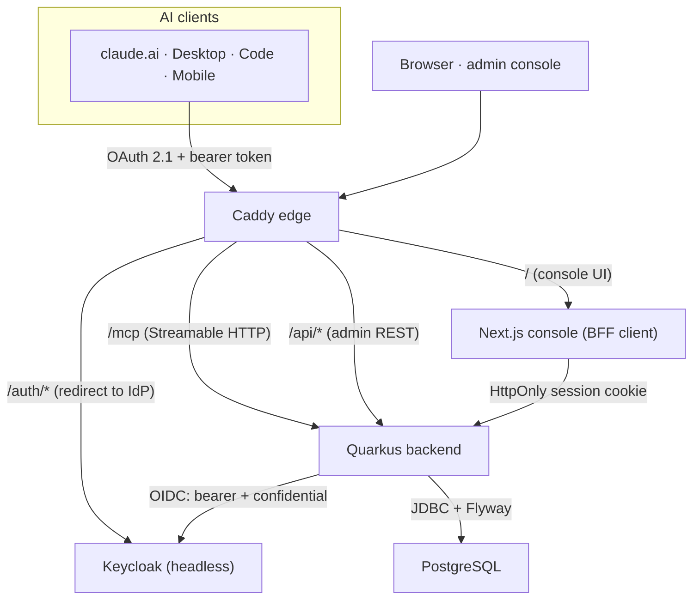

kumbuka is a single **Docker Compose** stack. One backend serves both the AI-
facing MCP surface and the team-facing admin API; it is the only component that
talks to the identity provider. Everything else is a well-understood building
block: PostgreSQL for storage, Keycloak for identity, Caddy at the edge, and a
Next.js console for the team.

## Components

| Component | Role |
|---|---|
| **Backend** — Quarkus / Java 21 | Serves `/mcp` (Streamable HTTP) and the admin REST API. The **only** component that talks to Keycloak. Uses Hibernate ORM + Panache over JDBC, with Flyway migrations and SmallRye health. |
| **PostgreSQL** | System of record for memory entries and scopes. Schema is managed by Flyway. |
| **Keycloak** | Identity provider, run **headless** — the realm is imported at startup and users are provisioned through the Admin API. OAuth 2.1 is mandatory for the remote MCP surface. |
| **Next.js admin console** | The team-facing UI. A **BFF client** — it never holds tokens (see below). |
| **Caddy** | Edge router and automatic TLS. Routes the console, the `/mcp` endpoint, and the auth host. |

## Topology

## The two OIDC roles

The backend plays **two** distinct OIDC roles against the Keycloak realm
`kumbuka`. This is the part worth understanding.

1. **Resource server (bearer)** for `/mcp`. AI clients discover the authorization
   server via **Protected Resource Metadata**
   (`/.well-known/oauth-protected-resource` → the Keycloak `kumbuka` realm) and
   present **audience-bound bearer tokens**. The token's subject is the acting
   user; the realm role (`member` / `admin`) drives authorization. Each `/mcp`
   call therefore runs as a specific authenticated user, which is what lets the
   same endpoint serve that user's private scope safely.

2. **Confidential web-app client (BFF)** for the console (`kumbuka-admin`). The
   browser is redirected to Keycloak and back to a backend callback; the backend
   holds the OIDC session and issues an **HttpOnly cookie**. **The frontend never
   holds tokens and never calls Keycloak directly** (except being redirected
   there to sign in). Every privileged call the console makes is brokered by the
   backend.

### The claude.ai connector

The connector client (`kumbuka-connector`) is **confidential + PKCE**. PKCE is
sent regardless of client type; the client secret provides a real
connector-level kill-switch (rotate it to revoke access) and matches claude.ai's
pre-registered id-plus-secret path. See
[Connecting an assistant](/en/get-started/connecting-an-assistant/).

## Data flow

- **An assistant reads/writes memory:** AI client → Caddy → `/mcp` on the
  backend (bearer token) → PostgreSQL. The user's identity on the token
  determines which scopes are visible, including their own private scope.
- **The team curates shared memory:** browser → Caddy → console → backend
  (session cookie) → admin REST API → PostgreSQL. **The console's read paths
  never return private entries** — there is no code path from an admin/team
  surface to anyone's private rows.
- **Identity operations** (invite, enable/disable, roles, connector-secret
  rotation) go through the backend's confidential service-account client to
  Keycloak. The frontend has zero Keycloak knowledge.

## Access control, in one line

`private` is readable/writable only by its owner via the MCP surface; `global`
and `project` are team-shared (members read, admins manage); authorship is
server-derived from the write channel. The private rule is enforced at the
**data-access layer**, not in the UI — see [Security & privacy](/en/operations/security/).

## Naming

Anything that names the product, org, or a deployable is branded `kumbuka`:
groupId `ai.kumbuka`, artifact `kumbuka-server`, npm `@kumbuka-ai/console`,
images `ghcr.io/kumbuka-ai/*`, compose services `kumbuka-backend` /
`kumbuka-console`, Keycloak realm `kumbuka`. The one deliberate exception is the
MCP tool verbs, which stay functional (`memory_*`).
