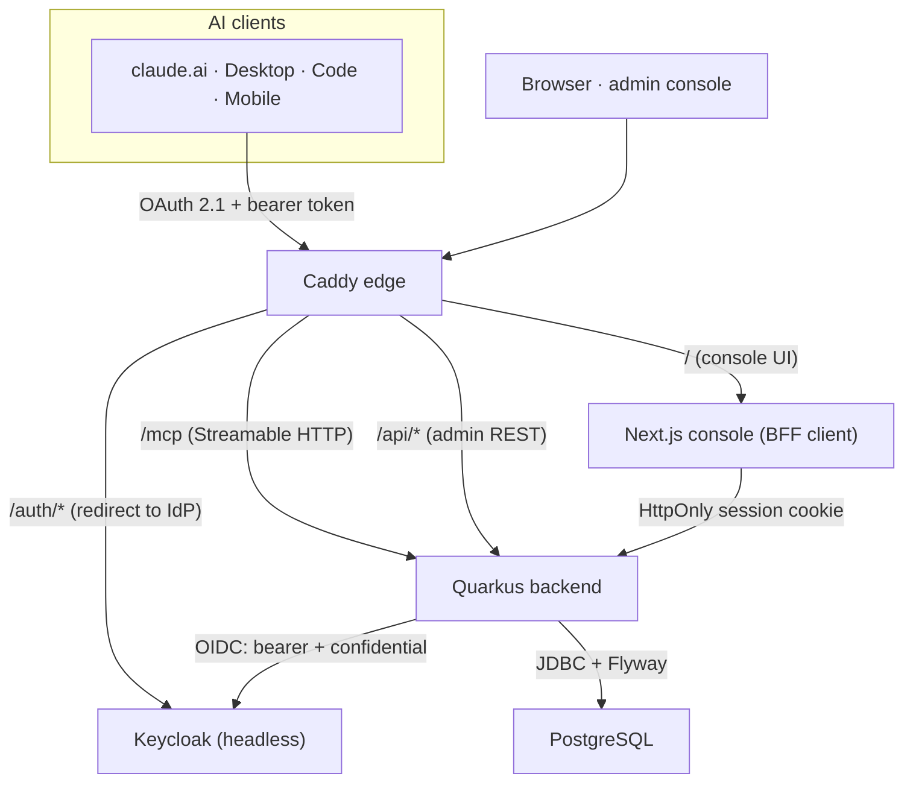

kumbuka ist ein einzelner **Docker-Compose**-Stack. Ein Backend bedient sowohl
die KI-gerichtete MCP-Oberfläche als auch die team-gerichtete Admin-API; es ist
die einzige Komponente, die mit dem Identity-Provider kommuniziert. Alles andere
ist ein gut verstandener Baustein: PostgreSQL als Speicher, Keycloak für
Identität, Caddy am Rand und eine Next.js-Konsole für das Team.

## Komponenten

| Komponente | Rolle |
|---|---|
| **Backend** — Quarkus / Java 21 | Bedient `/mcp` (Streamable HTTP) und die Admin-REST-API. Die **einzige** Komponente, die mit Keycloak kommuniziert. Nutzt Hibernate ORM + Panache über JDBC, mit Flyway-Migrationen und SmallRye-Health. |
| **PostgreSQL** | System of Record für Memory-Einträge und Scopes. Das Schema wird von Flyway verwaltet. |
| **Keycloak** | Identity-Provider, **headless** betrieben — der Realm wird beim Start importiert und Benutzer werden über die Admin-API bereitgestellt. OAuth 2.1 ist für die entfernte MCP-Oberfläche verpflichtend. |
| **Next.js-Admin-Konsole** | Die team-gerichtete UI. Ein **BFF-Client** — sie hält niemals Tokens (siehe unten). |
| **Caddy** | Edge-Router und automatisches TLS. Leitet die Konsole, den `/mcp`-Endpunkt und den Auth-Host weiter. |

## Topologie

## Die zwei OIDC-Rollen

Das Backend spielt **zwei** verschiedene OIDC-Rollen gegenüber dem Keycloak-Realm
`kumbuka`. Das ist der Teil, der es wert ist, verstanden zu werden.

1. **Resource Server (Bearer)** für `/mcp`. KI-Clients entdecken den
   Autorisierungsserver über **Protected Resource Metadata**
   (`/.well-known/oauth-protected-resource` → den Keycloak-`kumbuka`-Realm) und
   präsentieren **audience-gebundene Bearer-Tokens**. Das Subject des Tokens ist
   der handelnde Benutzer; die Realm-Rolle (`member` / `admin`) steuert die
   Autorisierung. Jeder `/mcp`-Aufruf läuft daher als ein bestimmter
   authentifizierter Benutzer, was es ermöglicht, dass derselbe Endpunkt den
   privaten Scope dieses Benutzers sicher bedient.

2. **Confidential-Web-App-Client (BFF)** für die Konsole (`kumbuka-admin`). Der
   Browser wird zu Keycloak und zurück zu einem Backend-Callback umgeleitet; das
   Backend hält die OIDC-Session und stellt ein **HttpOnly-Cookie** aus. **Das
   Frontend hält niemals Tokens und ruft Keycloak niemals direkt auf** (außer der
   Umleitung dorthin zur Anmeldung). Jeder privilegierte Aufruf der Konsole wird
   vom Backend vermittelt.

### Der KI-Client-Connector

KI-Clients verbinden sich als **OAuth-Clients mit PKCE**, angebunden allein
über die Endpunkt-URL: Ein Client weist sich gegenüber dem Autorisierungsserver
über seine veröffentlichten Client-Metadaten oder die dynamische
Client-Registrierung bei der ersten Autorisierung selbst aus — es gibt keine
Client-ID zum Kopieren und kein Client-Secret. Der Notausschalter auf
Connector-Ebene ist das **Deaktivieren des registrierten Clients** im
Identity-Provider. Siehe
[Einen Assistenten verbinden](/get-started/connecting-an-assistant/).

## Datenfluss

- **Ein Assistent liest/schreibt Memory:** KI-Client → Caddy → `/mcp` auf dem
  Backend (Bearer-Token) → PostgreSQL. Die Identität des Benutzers im Token
  bestimmt, welche Scopes sichtbar sind, einschließlich seines eigenen privaten
  Scopes.
- **Das Team kuratiert geteiltes Memory:** Browser → Caddy → Konsole → Backend
  (Session-Cookie) → Admin-REST-API → PostgreSQL. **Die Lesepfade der Konsole
  geben niemals private Einträge zurück** — es gibt keinen Codepfad von einer
  Admin-/Team-Oberfläche zu den privaten Zeilen einer Person.
- **Identitätsoperationen** (Einladen, Aktivieren/Deaktivieren, Rollen) laufen
  über den vertraulichen Service-Account-Client des Backends zu Keycloak. Das
  Frontend hat null Keycloak-Wissen.

## Zugriffskontrolle, in einer Zeile

`private` ist nur von seinem Eigentümer über die MCP-Oberfläche lesbar/schreibbar;
`global` und `project` sind team-geteilt (Members lesen, Admins verwalten); die
Urheberschaft wird serverseitig aus dem Schreibkanal abgeleitet. Die
private Regel wird auf der **Datenzugriffsebene** durchgesetzt, nicht in der UI —
siehe [Sicherheit & Datenschutz](/operations/security/).

## Benennung

Alles, was das Produkt, die Organisation oder ein Deployable benennt, trägt die
Marke `kumbuka`: groupId `ai.kumbuka`, Artefakt `kumbuka-server`, npm
`@kumbuka-ai/console`, Images `ghcr.io/kumbuka-ai/*`, Compose-Services
`kumbuka-backend` / `kumbuka-console`, Keycloak-Realm `kumbuka`. Die eine
bewusste Ausnahme sind die MCP-Tool-Verben, die funktional bleiben (`memory_*`).
